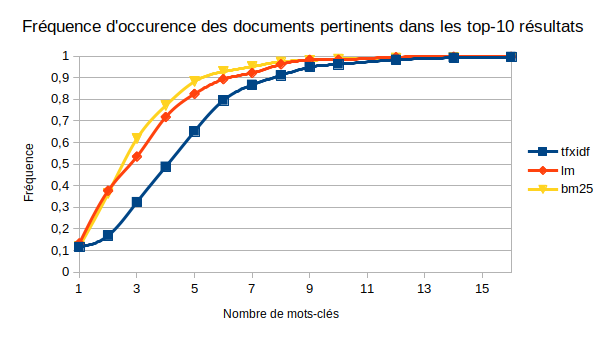
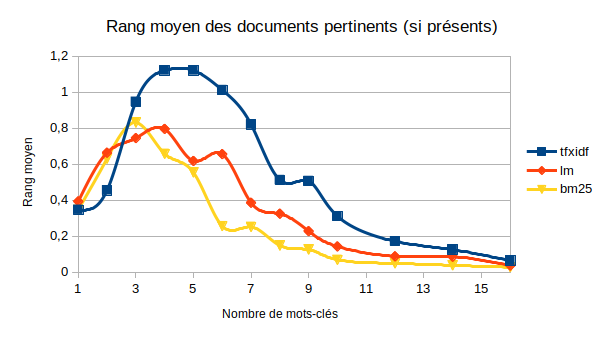

# Évaluation

## Évaluation système

## Exécution

    make [-j 4]

### Méthodologie

Les requêtes sont générées d'après les données disponibles :
 - *n* commentaires sont tirés au hasard
 - *k* mots sont tirés au hasard dans chaque commentaire

Les *k* mots constituent une requête, qui est statistiquement représentative du commentaire dont ils sont tirés.

Les requêtes sont exécutés sur le moteur de RI simple (non personnalisé) afin de comparer les représentations suivantes :
 - Modèle vectoriel TFxIDF
 - Modèle probabiliste BM25
 - Modèle de langue

Deux métriques sont issues de ce test :
 - La fréquence d'apparition du commentaire pertinant dans les top-10 résultats
 - Le rang moyen de ce commentaire lorsqu'il apparaît

### Résultats

Nombre de requêtes : *n* = 1000
Nombre de mots-clés : 1 ≤ *k* ≤ 16

### Interprétation

La valeur absolue de la métrique n'a pas de sens, mais les valeurs relatives permettent de comparer les modèles.

Les courbes des trois modèles présentent des allures similaires : 
 - Plus on utilise de mots-clés, plus on retrouve le commentaire. Ce n'est pas surprenant : à la limite, la requête contient tous les mots du commentaire initial.
 - Avec très peu de mots-clés, les rares documents trouvés apparaissent en haut de classement. Hormis ce cas particulier, plus on utilise de mots-clés, mieux les documents sont classés

Le modèle probabiliste BM25 offre les meilleurs résultats : pour un *k* donné, il trouve plus souvent les documents pertinents, et les classe  mieux.  
Le modèle de langue trouve presque aussi souvent les documents pertinents, mais les classe moins bien.  
Le modèle vectoriel est nettement moins efficace.

**TODO: Éviter le "on voit bien que..."**
